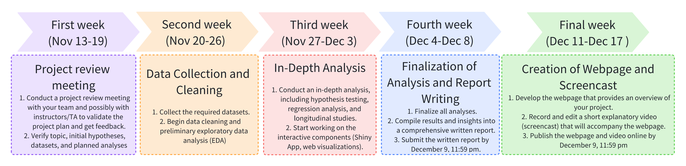

## Group members
|   Name         |    UNI      |          Contact                    |
|:------------:|:----------:|:----------------------------------:|
|  Pei Tian       |   pt2632   | pei.tian@columbia.edu              |
| Mengxiao Luan |   ml5018   | ml5018@cumc.columbia.edu           |
| Sitian Zhou    |   sz3213   | sz3213@cumc.columbia.edu           |
|   Yuzhe Hu    |   yh3676   | yh3676@cumc.columbia.edu           |
| Shuchen Dong |   sd3731   | sd3731@cumc.columbia.edu           |

## Tentative project title
- What makes Billionaires?

- Billionaires Unveiled: A Wealth Odyssey

- Counting Billions: A Global Wealth Analysis

- Billionaireomics: Decoding the World's Richest

## Motivations
1. Gain a comprehensive view of billionaire wealth dynamics.
2. Unravel factors contribute to billionaire success.
3. Explore implications for wealth distribution and economic conditions.
4. Contribute to the understanding of wealth distribution patterns.

## Intended final products
1. Report document
2. GitHub Page
3. Shiny App for visualization
4. Video

## Anticipated data sources
### Billionaire

- [1997-2023 Forbes Billionaire](https://www.kaggle.com/datasets/guillemservera/forbes-billionaires-1997-2023?select=all_billionaires_1997_2023.csv)

- [Billionaire with the country economic indicator in 2023](https://www.kaggle.com/datasets/nelgiriyewithana/billionaires-statistics-dataset)

### Industry Economics

[Gross Domestic Product by Industry Group **(ONLY USA)**](https://www.bea.gov/data/gdp/gdp-industry)

### Country Economics & Geography 

- [Country Capital](https://www.kaggle.com/datasets/madhurpant/world-geographic-and-climatic-dataset)

- [Country GDP](https://www.kaggle.com/datasets/willianoliveiragibin/world-gdp-by-country-region-and-income-group?select=gdp_data.csv)

- [Country Code](https://www.kaggle.com/datasets/juanumusic/countries-iso-codes)

## Planned analysis & visualizations 
### Data Cleaning

Quality control, format consistency maintenance for data usage

Select variables to reduce redundancy

Tidy key variables to ensure the feasibility of joining operation

### EDA, Categorical

**Regarding general distribution:**

What is the numeric distribution of billionaires of different states?

- number of billionaires with different wealth amounts
- number of billionaires through different approach(self-made or not)
- number of billionaires with different wealth status(increase or decrease)

**Regarding individual details:**

What is the distribution of billionaires when divided by demographic information?

- number and average wealth of billionaires in different gender
- number and average wealth of billionaires across age groups
- number and average wealth of billionaires in different countries(residence and nationality)

**Regarding industry and economic development:**

What is the potential relationship between billionaires and their business industries?

- number and average wealth of billionaires distributed in different business industries(regarding the economic development and taxation of the industry)

### EDA, Longitudinal

**GDP-Temporal Wealth Patterns**

Examine the rise and fall of billionaire wealth across different economic cycles, including booms, busts, and recoveries.

**Industry-Lifecycles and Billionaire Wealth**

Explore how technological disruptions in various sectors impact the net worth and ranking of billionaires over time.

**Geo-Economic Shifts**

Track shifts in the geographic distribution of billionaires over time and correlate these with changing economic powers and policies in different regions.

Analyze trends in wealth concentration in relation to global economic shifts, such as the rise of (Asia?) as an economic powerhouse.

**Pandemic Response and Wealth Elasticity**

Measure the elasticity of billionaire wealth in response to the COVID-19 pandemic.

Compare the wealth growth rates of billionaires in healthcare and technology before, during, and after the pandemic to those in more traditional industries.

### EDA, Geographic

Interactive visualization for top-ranked billionaires in different regions (countries, continents)

Interactive visualization for GDP of different countries in different years

Compare billionaire distribution in different regions (such as average wealth, gender composition)

Provide geographic visualization interface for other analysis results

### Hypothesis Testing

**Compare wealth between age groups**: ANOVA (check assumptions, transformation may be applied)

**Compare wealth between gender groups**: T-test

**Compare the proportion of female billionaires in 2013 and 2023**: Two sample prop test

**Compare the proportion of billionaires in a certain industry (eg. Tech) in 2013 and 2023**: Two sample prop test

If result is significant, we could further look into the industry GDP dataset to explore the trend of that industry

### Regression

When the topic of billionaires comes up, one can't help but wonder what factors led them to become billionaires. Here, multiple linear regression will be adapted to analyse the problem. To be specific, the net worth of billionaires is going to be selected as the dependent variable, combining factors that may be related to it that can be quantified as the dependent variables, such as: the corresponding age of billionaires, gender, years of education, the total annual GDP of the country they belong to, the total tax rate of the country they belong to, and potentially other factors. Based on the linear regression results, we will adjust the factors accordingly, interpret the results in real context, and evaluate the usability of the model to fit the available data through evaluation criteria such as R-squared and AUC.

## Coding challenges
1. Data tidying challenge: handle key variables with the same meaning but different exact values from different datasets.
2. Website Design: We want to build a fancier website with advanced settings.
3. R-Shiny interactive dashboard: We plan to use R-Shiny to build an interactive platform.
4. Model fitting: Variable selection and interpretation could be a challenge.
5. GitHub Collaboration: branch management via Git

## Planned timeline
